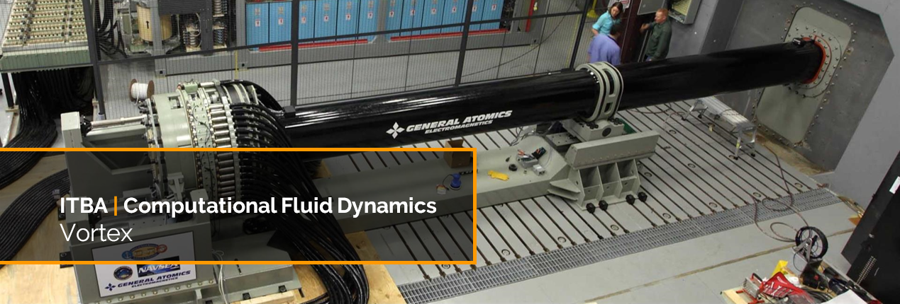

[](https://github.com/agustin-golmar/Vortex/blob/master/doc/(2018)%20Computational%20Fluid%20Dynamics.pdf)
[](https://github.com/agustin-golmar/Vortex/blob/master/LICENSE.md)
[](https://github.com/agustin-golmar/Vortex/releases)
[](https://www.travis-ci.com/agustin-golmar/Vortex)

# Vortex

An implementation of the _FHP model_ (with 6 velocity degrees of freedom),
based on _cellular automatons_, for the simulation of a 2D fluid. This model
can solve the _Navier-Stokes equation_ for an incompressible flow.

## Build

To build the project, it is necessary to have _Maven +3.5.0_, and
_Java SE 10 Release_ installed. Then, run:

```
$ mvn clean package
```

This will generate a _\*.jar_ in the root folder. If you find any issues with
the building, remove the _\*.jar_ files from the _Maven_ local repository
with:

```
$ rm -fr ~/.m2/repository/ar/nadezhda/*
```

Or do it manually, if you prefer.

> __NOTE:__ If you wish to import this project in _Eclipse IDE_, you should
> install the [m2e-apt](https://marketplace.eclipse.org/content/m2e-apt)
> plugin. This way, _Dagger_ will compile the modules and components
> automatically.

## Execution

In the root folder, type:

```
$ java -jar vortex.jar <mode>
```

Where _\<mode\>_ can be:

* `simulation`: Runs a complete simulation of the specified system in
configuration.

If you want to change the logging mechanism, simply call the application with:

```
$ java -Dlogback.configurationFile=logback.xml -jar vortex.jar <mode>
```

Where `logback.xml` is the configuration file. You can change this and use
whatever other file you want. By default, _Vortex_ will log to the console.

## Configuration

The configuration must be in a file named `vortex.json`, located in the root
folder. It must contain the following properties:

```
{
    "shape"         : "res/shape/barrier.shape",
    "output"        : "res/data/output",

    "lattice"       : [1920, 1080],
    "dimension"     : [1.0, 1.0],
    "steps"         : 100000,
    "window"        : 100,
    "average"       : 32,

    "contour"       : "non-periodic",
    "momentum"      : "left-to-right",
    "ratio"         : 0.1,

    "seed"          : 35265826342033,
    "cuda"          : false,
    "saveAutomaton" : false
}
```

## Libraries

This application uses these _Java_ libraries to complete its task:

* __[Apache Commons-Math v3.6.1](http://commons.apache.org/proper/commons-math/)__:
Because it has the _Mersenne Twister PRNG_, which is more uniform than _LCG_.
* __[Dagger v2.16](https://google.github.io/dagger/)__: As the fully static DI
framework.
* __[Jackson v2.9.6](https://github.com/FasterXML/jackson)__: For reading the
JSON configuration.
* __[Logback v1.3.0-alpha4](https://logback.qos.ch/)__: As the logger
infrastructure.
* __[SFL4J v1.8.0-beta2](https://www.slf4j.org/)__: The facade of the logger.

## Designer

This project has been built, designed and maintained by:

* [Agustín Golmar](https://github.com/agustin-golmar)

## Bibliography

__"Introduction To Practice Of Molecular Simulation"__. Akira Satoh. _Elsevier
Inc. ISBN 978-0-12-385148-2. Akita Prefectural University, Japan. 2011_.

__"Lattice Boltzmann Modeling"__. Michael C. Sukop, Daniel T. Thorne Jr.
_Springer-Verlag Berlin Heidelberg. ISBN 978-3-540-27982-2. USA. 2006_.

__"Lattice-Gas Cellular Automata And Lattice Boltzmann Models - An
Introduction"__. Dieter A. Wolf-Gladrow. _Springer. Alfred Wegener Institute
for Polar and Marine, Germany. June 26, 2005_.

__"Cellular Automata As Models Of Complexity"__. Stephen Wolfram. _Nature,
Vol. 311, N° 5985. Macmillan Journals, 1985. The Institute For Advanced Study,
Princeton, New Jersey, USA. October 4, 1984_.
